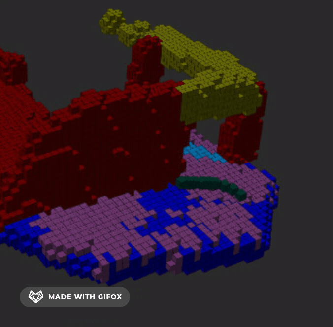
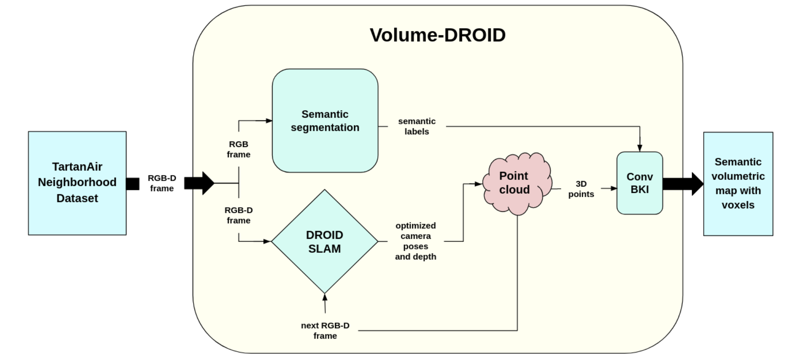

# Volume-DROID: All You Need is a Camera
-------------------------------------------------------------------------------------------------------------------------------
Implementation of the winter 2023 ROB 530/NA 568 team 13 final project: Volume-DROID
-------------------------------------------------------------------------------------------------------------------------------

Authors: Peter Stratton (pstratt@umich.edu), Nibarkavi Naresh Babu Amutha (nibah@umich.edu), Ashwin Saxena (ashwinsa@umich.edu), Emaad Gerami (egerami@umich.edu), Sandilya Garimella (garimell@umich.edu)

  

## Overview

  

Volume-DROID is a novel SLAM architecture created by combining the recent works: DROID-SLAM and NeuralBKI. Volume-DROID takes camera images (monocular or stereo) or frames from video as input and outputs semantic mapping of the environment via combination of DROID-SLAM, point cloud registration, off-the-shelf semantic segmentation and ConvBKI. The novelty of our method lies in the fusion of DROID-SLAM and ConvBKI by the introduction of point cloud generation from RGB-Depth frames and optimized camera poses. By having only camera images or a stereo video as input, we achieved functional real-time online 3D semantic mapping.

NeuralBKI code adapted from: https://github.com/UMich-CURLY/NeuralBKI \
DROID-SLAM code adapted from: https://github.com/princeton-vl/DROID-SLAM
